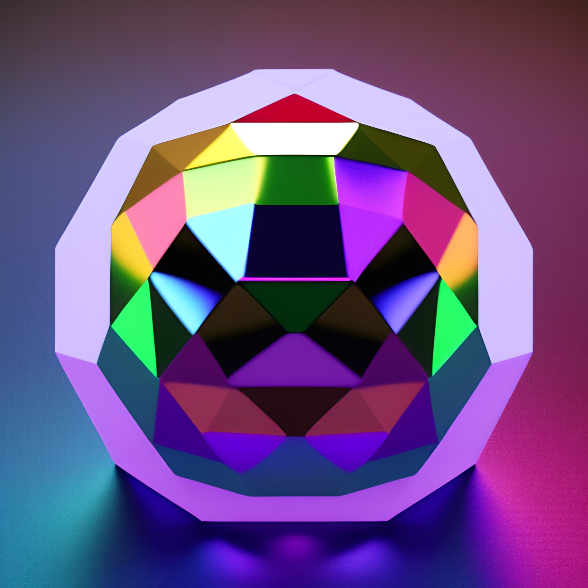

#  BioSphere.gg
- `BioSphere:` Welcome to my personal [bio](https://google.com/) website![^BETA] Here, you can learn more about me, my interests, and my professional experience. From my education to my work history, I've provided a comprehensive overview of my background. You'll also find some of my recent projects, hobbies, and achievements. Feel free to take a look around and get to know me better. Thank you for visiting!

   

## Web Structure And Info 

[^BETA]: `STAGEOFDEV: *-BETA*`

>    

- This website is a result of many hours of hard work and dedication. My main focus was to make it visually appealing, and currently it's available to view on `Android` and `iOS` devices. Soon, I'll be optimizing it for `PC` and `Mac` as well, _as soon as I find the time_.

### Available For

>  

> - [View Licence](LICENCE.md) **Before doing Anything**.
